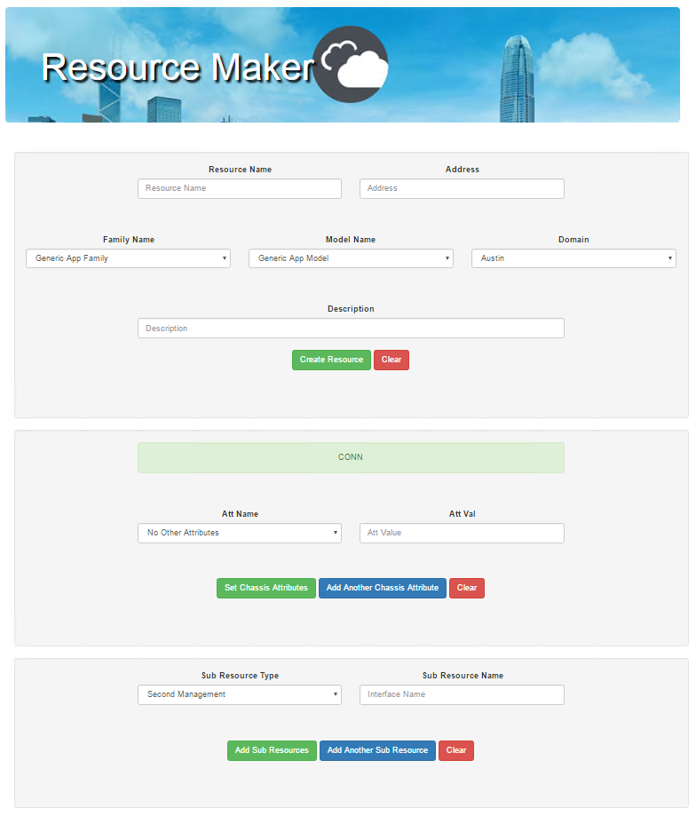

# About this repo
_Quali CloudShell Service_

This is a proof of concept to allow a streamlined way to bulk manually add resources.

It is a simple service that will run a webservice allowing the user to tab through a web form to create resources. 

This is more manual work than [loading from a spreadsheet](https://github.com/QualiSystemsLab/AutoImportResources), but less than using the Resource Manager UI, so it has certain use cases.

# Requirements
* Tested on CloudShell version 7.1
* this is a proof of concept and a security risk so use at your own risk!

# Using this repo
## From CloudShell
* First zip the src directory and rename the zip to ResourceMaker.zip
* Place that into ENVIRONMENT/Resource Drivers - Python folder
* Zip the ENVIRONMENT folder
* Upload that zipped enivornment package to your CloudShell web portal
* Reserve the environment and run the `Run Resource Maker` command on the service
* click the link in the output window to get to the temporary service
* When complete, terminate the command on the service in the portal!

## From CLI
* Extract the sec directory somewhere
* Use the Exe Server Python CLI or another CLI with the requirements.txt installed to run the driver.py: `C:\Users\chris.g>"c:\Program Files (x86)\QualiSystems\TestShell\ExecutionServer\python\2.7.10\python.exe" Desktop\resourcemaker\src\driver.py`

# Sample Screenshot
